# Using OpenVPN Connect Web

*`openvpn-connect-web` — an unofficial panel for the `openvpn` client on your own machine, not
OpenVPN Inc.'s* OpenVPN Connect *app.*

A walkthrough of the panel, screen by screen. [README.md](README.md) covers what it is, how it is
built and how to install it; this file is what it looks like to use.

Every screenshot on this page is generated, not staged. `tools/screenshots.py` seeds a throwaway
database with invented data, serves the real app with a stubbed tunnel, and photographs it — so
these are the actual templates, CSS and endpoints, and none of it is anybody's real VPN. The
addresses are documentation ranges, the domains are `example` ones, and the two connections do not
exist. See [Regenerating these images](#regenerating-these-images) at the bottom.

---

## Signing in

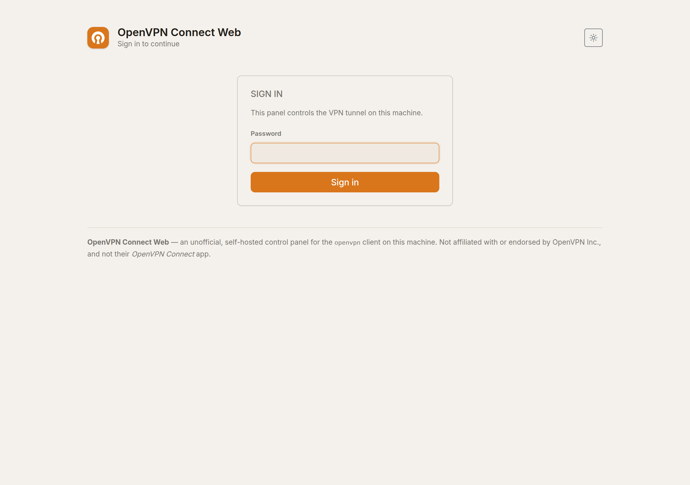

One password, no user accounts — this is a panel for one machine and one person. Five wrong
attempts locks the address out for five minutes.

The password does more than let you in: it derives the key that decrypts your stored connections.
That is why a restart signs you out, and why nothing can connect the tunnel until somebody has
signed in at least once. If the app has no password configured yet it shows a setup page instead,
telling you the command to run.

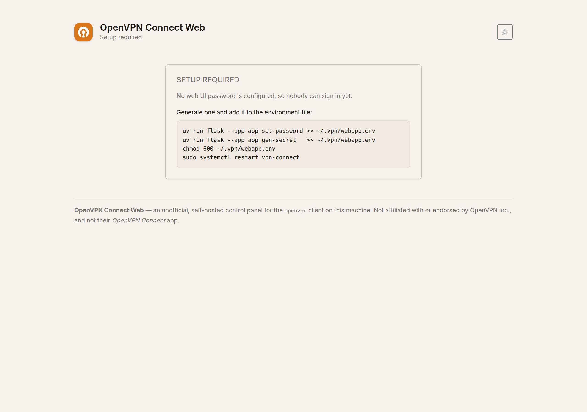

That page is what a fresh install looks like, and it is deliberately a dead end: the commands have
to be run on the machine itself, because setting a password from a page that anybody can reach
would be a way in rather than a way to close one.

---

## Adding a connection

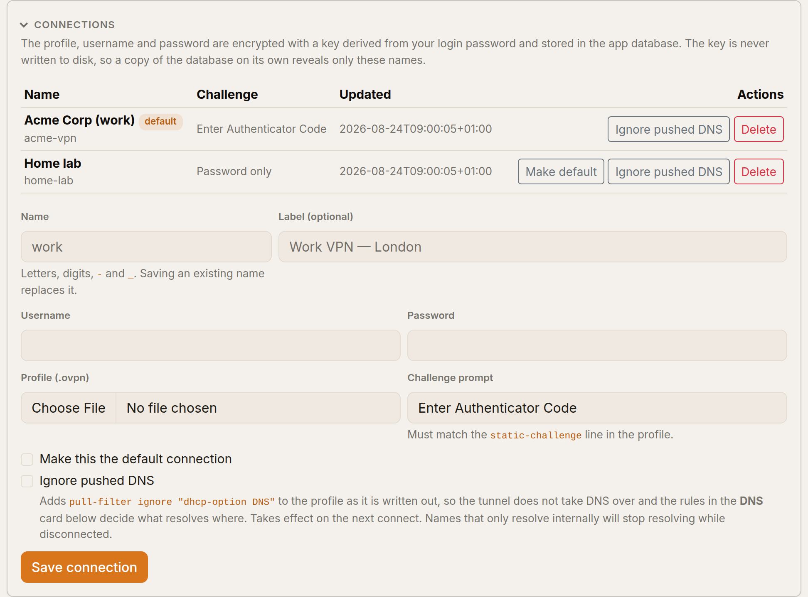

Upload the `.ovpn` your VPN provider or IT department gave you, give it a name, and put in the
username and password that go with it. Everything — profile, username, password — is encrypted in
the database under the key derived from your login password.

Two things are read from the profile rather than asked for:

- **Whether it needs an authenticator code.** A `static-challenge` line in the `.ovpn` is
  OpenVPN's own statement that the server will ask for a second field. Profiles that have one get
  a code box; profiles that do not sign in with the stored password alone.
- **The wording of the code prompt**, if there is one — so the panel asks for exactly what the
  server calls it.

**Ignore pushed DNS** is the one thing worth knowing about here. Tick it if you want the tunnel to
carry traffic but leave your machine's DNS alone; see [DNS](#dns) below for how to tell whether you
need it.

---

## Connecting

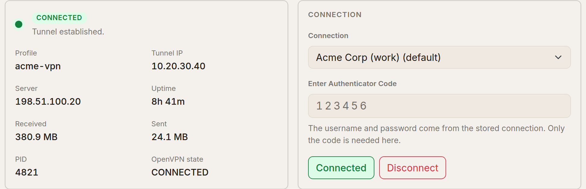

Pick the connection, type the code if it needs one, press Connect. The status card fills in as the
tunnel comes up and then keeps reporting: uptime, the tunnel address, the server, bytes each way,
the OpenVPN process id and OpenVPN's own state name.

Disconnecting asks for confirmation — it is one click away from cutting your own connection to the
panel if you are reading it over the VPN.

---

## Is it actually carrying what I think?

### Tunnel scope

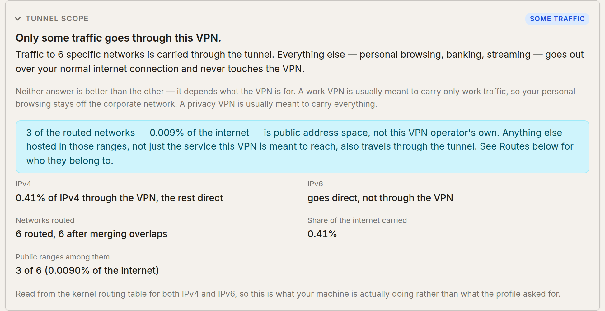

The headline answer, in a sentence: everything, some of it, or nothing. Neither full nor split is
"correct" — a work VPN is usually meant to carry only work traffic, and a privacy VPN is usually
meant to carry everything — so the panel tells you which one you have rather than grading it.

Two things here are worth more than the percentage:

- **IPv6.** If IPv4 goes entirely through the tunnel and IPv6 still leaves your machine directly,
  you are leaking, and the panel says so in as many words. A *split* tunnel with direct IPv6 is
  not flagged, because on a work VPN that is the intended arrangement.
- **Public ranges.** A split tunnel that routes public address space is pulling in everything else
  hosted in those ranges too, not just the service it was meant to reach.

### Routes

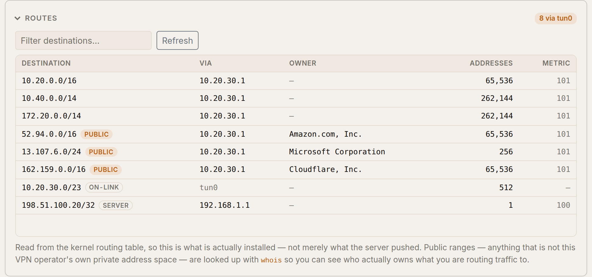

Every prefix the tunnel actually installed, read from the **kernel routing table** rather than
from what the server offered — those diverge whenever a route is rejected or overridden. Public
ranges are tagged and looked up with `whois`, so a pushed block reads as "Amazon.com, Inc." rather
than as an opaque CIDR. The filter box is there because a real corporate tunnel can install
hundreds of these.

Two rows are tagged as not-pushed: **on-link** (the tunnel's own subnet) and **server** (the route
to the concentrator itself, pinned to the physical NIC so the tunnel's own packets do not try to
travel through the tunnel).

### Routes the server asked for and did not get

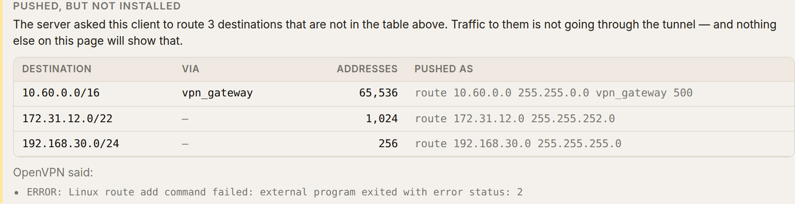

The table above answers "what *is* the tunnel carrying?". This one answers the question that
actually bites: "what did the server ask for that never happened?"

It matters because there is nothing else to notice. The connection succeeds, the status card is
green, the traffic graph moves — and one internal range is quietly unreachable. You find out when
a colleague asks why you cannot reach the thing everyone else can.

Reading it:

- **Destination** is the range that is missing. **Addresses** is how much of the network it
  covers, so you can tell a single server from a whole site.
- **Via** is the gateway the server named. `vpn_gateway` is not a mistake — it is OpenVPN's own
  word for "whatever this tunnel's gateway turns out to be".
- **Pushed as** is the option exactly as it arrived. This is the line to paste to whoever runs the
  VPN, because it is the line they wrote.
- **OpenVPN said** appears when the client left an explanation in its log. Those are its words,
  not ours.

The whole block is hidden when there is nothing wrong, and the count next to the panel title —
*3 not installed* — is visible with the panel still collapsed, so you do not have to go looking.

Two things it will not do. It stays quiet on a tunnel this panel did not start, because the
server's message arrives once, at the moment of connecting, and it was not listening then. And if
*every* pushed route is missing it says so as one problem rather than as a list, because that is
one setting somewhere, not thirty separate failures.

Nothing here is something you can fix from this page. It is the evidence, and it is usually the
VPN administrator's to act on.

### DNS

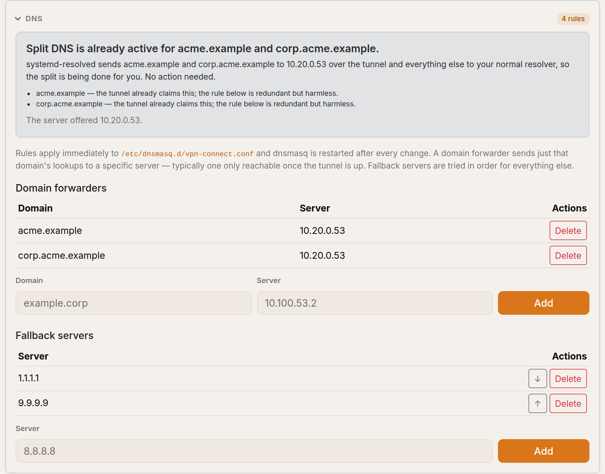

The panel first tells you **who is actually resolving what**, read from systemd-resolved. This
matters more than it sounds: OpenVPN 2.6+ configures DNS itself, so a tunnel can quietly take over
*every* lookup on the machine — at which point the rules below are being bypassed entirely, and
the panel says so instead of letting you believe otherwise.

Below that are the rules themselves, written to `/etc/dnsmasq.d/vpn-connect.conf`:

- **Domain forwarders** send one domain's lookups to a specific server, typically one that only
  exists once the tunnel is up.
- **Fallback servers** answer everything else, in the order listed.

Every change applies immediately — there is no separate "Apply" step to forget, because a saved
rule that had not been installed would be a second version of the truth.

---

## Traffic

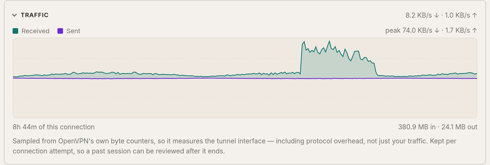

Sampled from OpenVPN's own byte counters, so it measures the tunnel interface — protocol overhead
included, not just your traffic. Counters are stored as OpenVPN reports them and rates are worked
out when the graph is drawn, so a late sample averages over the gap instead of baking a false
spike into the record for ever.

The samples are kept per connection attempt, so a past session can still be reviewed after it ends.

---

## Session history

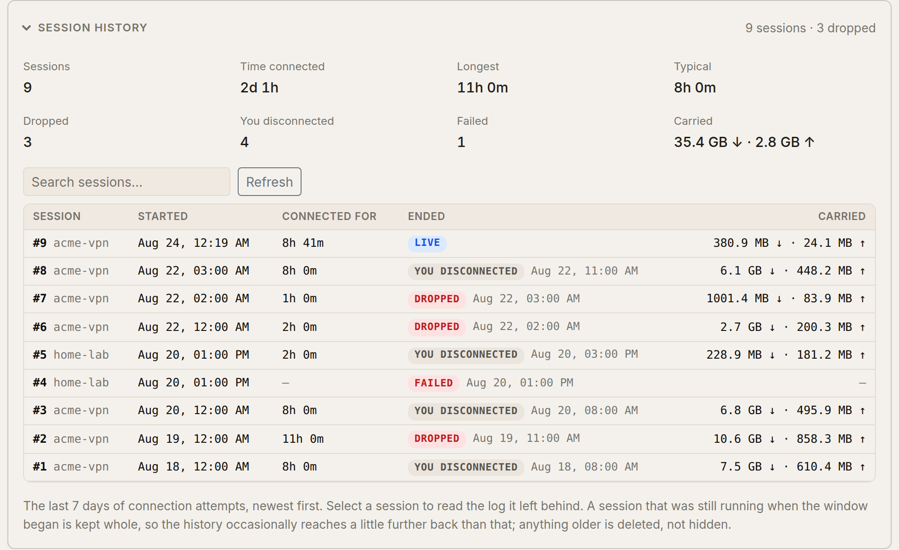

The question a status page cannot answer: *does this tunnel stay up?* The last seven days of
attempts, newest first, with the totals for the window above them.

The distinction the panel exists for is between the ways an attempt ends:

| Shown as | What happened |
| --- | --- |
| **Dropped** | the tunnel was up and the link was lost — nobody asked for that |
| **You disconnected** | the tunnel was up and you pressed Disconnect |
| **Failed** | it never came up — a rejected credential, a mistyped code, no route to the server |
| **Interrupted** | the app stopped while the tunnel was up |
| **Live** | the attempt running right now |

"Time connected" counts only attempts that actually came up: folding a fifteen-second failed login
into a median would drag it towards zero every time a code is mistyped.

### Reading a session's log

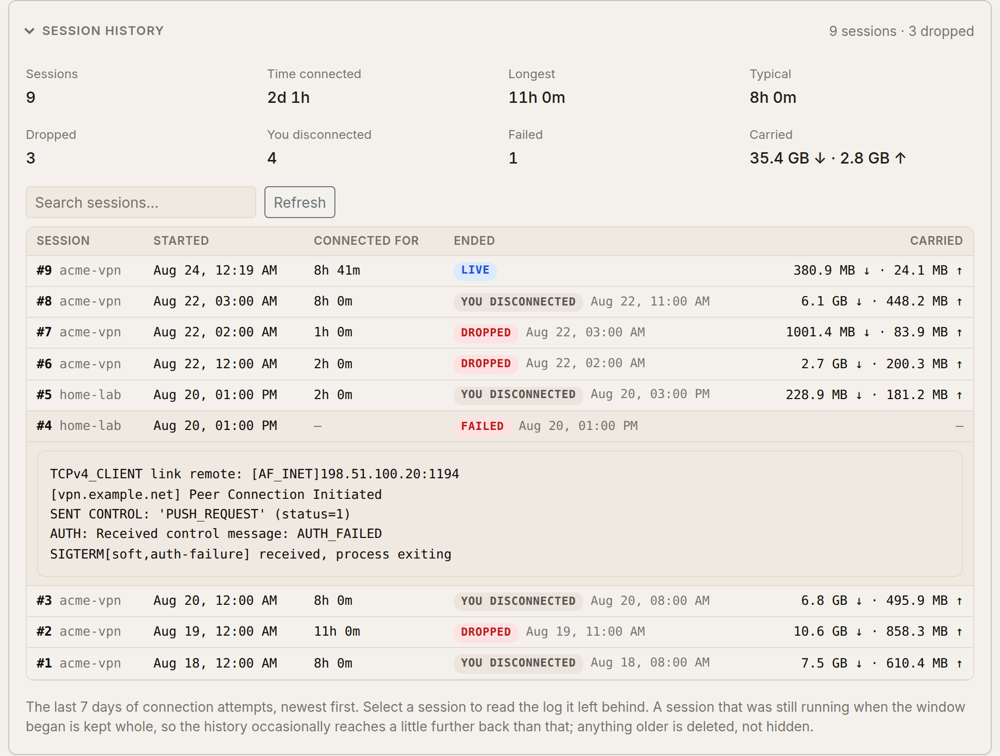

Select any row to open the log that attempt left behind — including a failed one, whose process
exited days ago. This is the thing an in-memory log buffer could never do: it emptied exactly when
you wanted to read it.

### Searching

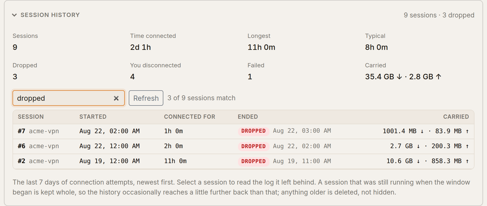

The box narrows the list you are already looking at. It matches a session number, a connection
name, or **how the session ended** — `dropped`, `failed`, or `work dropped` for both at once. The
totals above keep describing the whole week rather than the search, because "three drops" means
nothing without three out of how many.

There is no date filter. The table is already in time order with every row stamped, seven days is
a short enough list to scroll, and a machine that spends two of those days switched off would
answer a date range with an empty table and no explanation — where a visible gap between two dated
rows tells you exactly what happened.

**Seven days means seven days.** Anything that ended before the cutoff is deleted — rows, log lines
and traffic samples together. A session that *started* before the cutoff but ended inside the
window is kept whole, back to its beginning, so a slightly-older-than-seven-days row is correct
rather than a bug: cutting it at the boundary would report a nine-hour tunnel as a one-hour one.

---

## Inbound protection

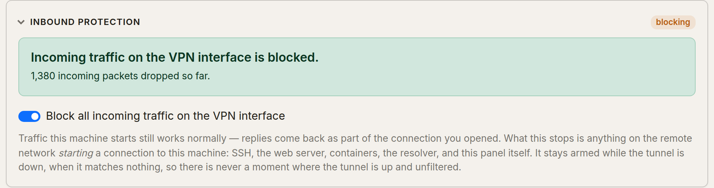

**Inbound protection** is the switch that stops the network at the far end of the VPN from reaching
anything on this machine. It is worth understanding what it does and does not cover.

What it blocks: anything on the remote network *starting* a connection to this machine — SSH, a web
server, a container's published port, the DNS resolver, this panel. What it does not touch: anything
this machine starts. Those replies arrive as part of a connection you opened, so browsing, DNS
lookups and the tunnel itself all carry on exactly as before.

The count beside the panel title is visible with the panel still collapsed, and it says which of
four things is true:

| Badge | Means |
| --- | --- |
| `blocking` | Switched on, and the filter is in force. |
| `off` | Switched off. Incoming traffic on the tunnel is allowed. |
| `not in force` | **Switched on, and not actually filtering.** The panel explains, and connecting is refused. |
| `unavailable` | This machine has no nftables, so the switch cannot do anything. |

The panel reports a **drop counter**, which is the evidence that the rule is doing something. A
count of zero while a tunnel is up is reported as "nothing has tried yet" rather than as success —
zero means either nothing tried or the rule is not on the path, and those are worth telling apart.

Two behaviours that are deliberate:

- **It stays armed while the tunnel is down**, when it matches nothing. That is what removes the
  window where a tunnel is up and not yet filtered.
- **If it is switched on but not in force, connecting is refused.** The app tries to put the filter
  back first — a reboot clears it — and only refuses if it cannot. To connect anyway, switch the
  protection off, which is a decision rather than an accident.

## Notifications

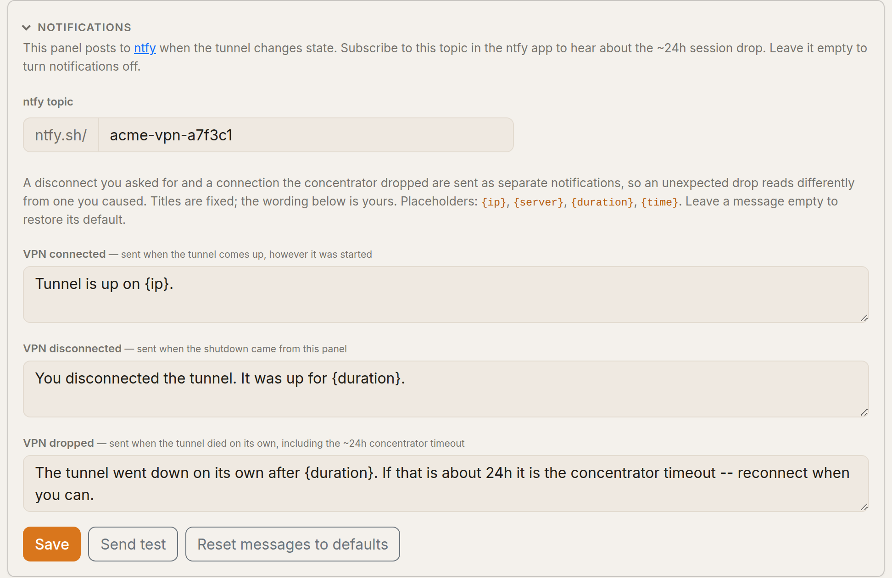

Push notifications via [ntfy](https://ntfy.sh), which needs no account: pick an unguessable topic,
subscribe your phone to it, and the app posts to it. Three messages, and the difference between
the last two is the point — **you** disconnecting and the concentrator **cutting you off** are not
the same event, and OpenVPN's own hooks cannot tell them apart.

Titles are fixed and only the bodies are editable. That is a security decision as much as a design
one: the title becomes an HTTP header, and text that cannot be edited cannot be used to inject one.

---

## The tunnel's own log, and the event history

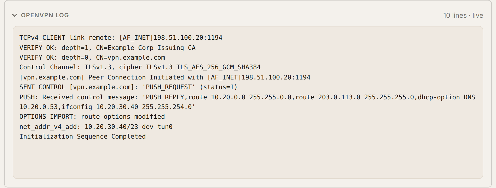

OpenVPN's live output, straight from the management interface — the first place to look when a
connection fails. Credential chatter is redacted before it is stored or shown.

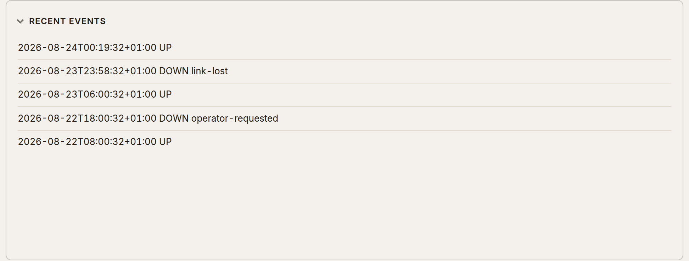

Every up and down with its reason, which is the short version of the session history above.

---

## Light and dark


The theme follows your system by default and the toggle in the header overrides it. Your choice is
applied before the page paints, so there is no flash of the wrong palette on load.

---

## Regenerating these images

The screenshots are build artefacts, not hand-made assets — the same rule as the icons. Refresh
them after any change to the UI:

```bash
uv run --group screenshots python tools/screenshots.py
```

It seeds a throwaway installation under `/tmp`, serves it on port 5099 with a stub in place of the
tunnel, drives the Google Chrome already on the machine, and writes every PNG in
`docs/screenshots/`. Nothing it does touches the real database, the real tunnel or the network. To
poke at the seeded instance yourself rather than photographing it:

```bash
uv run --group screenshots python tools/screenshots.py --keep-serving
```

Playwright lives in its own dependency group precisely so that neither a normal install nor CI ever
downloads it.
